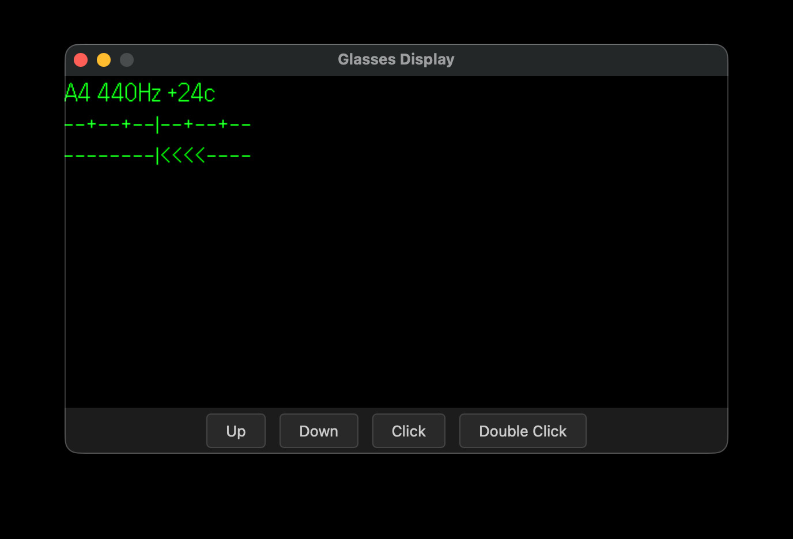

# Invisible Tuner

A chromatic tuner for [Even Realities](https://www.evenrealities.com/) smart glasses. Detects pitch from the glasses' microphone and displays the nearest note, reference frequency, and cent deviation on the heads-up display.

<p align="center">
  
</p>

## Note

My G2 hasn't arrived yet, so this has not been tested on actual hardware. If anyone could give it a try, that would be greatly appreciated!

## Prerequisites

- Node.js >= 20
- Rust toolchain with `wasm32-unknown-unknown` target
- [wasm-pack](https://rustwasm.github.io/wasm-pack/)

## Setup

```bash
npm install
npm run wasm:build
```

## Development

```bash
# Start Vite dev server + Even Hub simulator
npm run dev:sim
```

Or run them separately:

```bash
npm run dev   # Vite dev server on http://localhost:5173
npm run sim   # Even Hub simulator pointing to the dev server
```

## Build

```bash
npm run build
```

## Project structure

```
src/
  main.ts          Entry point — bridges audio events to pitch detection and display
  audio-buffer.ts  Buffers PCM frames into analysis-sized chunks
  tuner-ui.ts      Pure functions for rendering note/cents text and gauge
wasm-tuner/
  src/lib.rs       YIN pitch detection algorithm (Rust → WebAssembly)
```

## License

MIT
